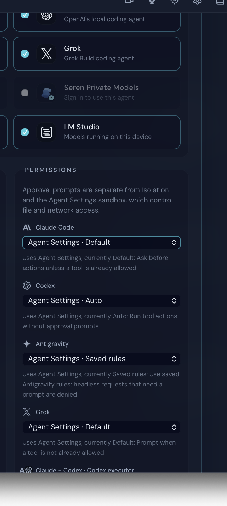
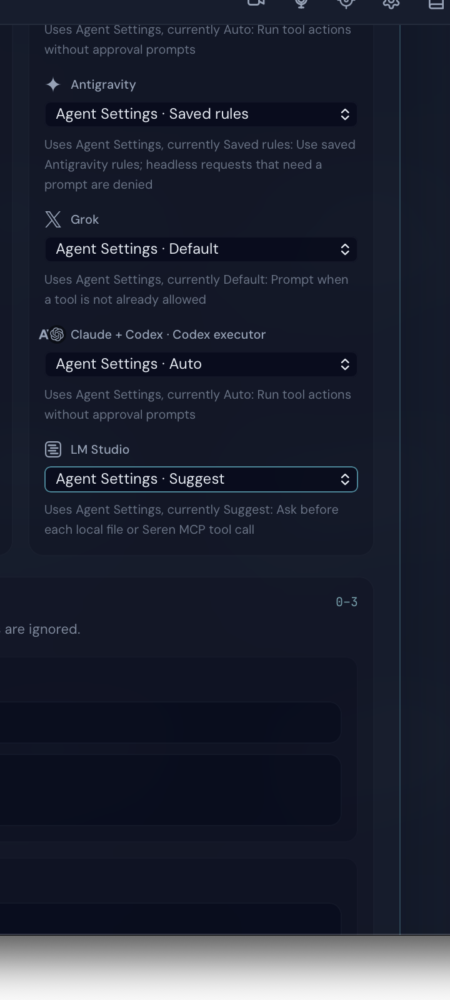
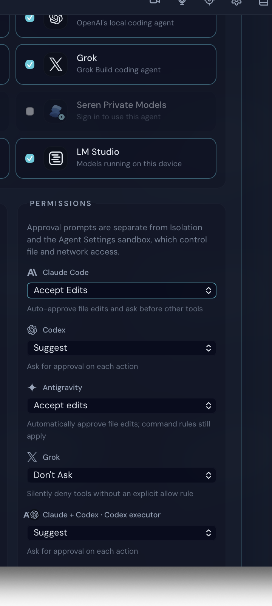
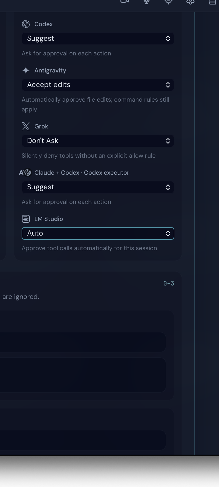

# Issue 3646 live walkthrough

Date: 2026-08-03

Platform: macOS native Tauri validation app

State: isolated local project, signed out (sign-in is not required for local permission catalogs)

## Reproduction before the fix

1. Open Mission Control from the title bar.
2. Expand **Advanced controls**.
3. Review **Permissions** for each selected local agent.
4. The UI previously showed the same generic Review/Auto labels and descriptions for every runtime, regardless of the runtime's actual permission modes.

## Fixed walkthrough

1. Launch the native app from the issue branch with a slot-specific app-data home and Keychain.
2. Open a real temporary project, open Mission Control from the title bar, and expand **Advanced controls**.
3. Enable Claude Code, Codex, Antigravity, Grok, Claude + Codex, and LM Studio.
4. Confirm each inherited choice names its provider-native Agent Settings default and explains the effective behavior.
5. Select every option exposed by every live provider catalog. The walkthrough fails if any expected option is absent.
6. Select representative non-default modes and confirm that each runtime keeps its native naming and description.

## Completeness result

- Claude Code: inherited default, Default, Accept Edits, Plan Mode, Bypass Permissions.
- Codex: inherited Auto, Auto, Suggest.
- Antigravity: inherited Saved rules, Saved rules, Accept edits, Plan, Skip permissions.
- Grok: inherited Default, Default, Accept Edits, Don't Ask, Always Approve, Plan.
- Claude + Codex executor: inherited Auto, Auto, Suggest.
- LM Studio: inherited Suggest, Suggest, Auto.

The exact selected mode IDs are recorded in [permission-catalog-verification.json](./permission-catalog-verification.json).

## Scrubbed screenshots

Only the Mission Control permissions panel is retained; desktop history, paths, identifiers, tokens, and screenshot metadata were removed. Each pair is two consecutive native viewport frames (upper and lower), not a composite.

## Keychain isolation re-check

The host CLI home was exposed only to the local provider-runtime child. The validation app kept its slot-specific app data and Keychain, and no Keychain prompt appeared during this walkthrough.

## Network path

This change has no outbound publisher or third-party API path. Mission Control calls the local provider-runtime RPC, which reads mode definitions from the installed local runtime adapters. The host-CLI validation option is scoped to that local provider-runtime child process; the app's data and Keychain remain isolated.
