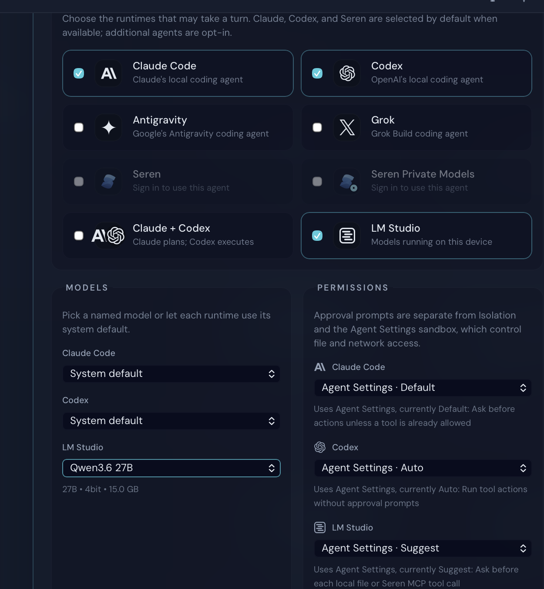

# Issue 3649 live walkthrough

Date: 2026-08-03

Platform: macOS native Tauri validation app

State: isolated local project, signed out (sign-in is not required for local LM Studio inventory)

## Reproduction before the fix

1. Leave the LM Studio server stopped with downloaded chat models installed.
2. Open Mission Control from the title bar and expand **Advanced controls**.
3. Enable **LM Studio** and inspect its model picker.
4. The picker previously exposed only `System default`, even though the live `lms ls --llm --json` inventory contained five chat models. The runtime would silently run the first downloaded model.
5. Reopening Advanced controls did not retry LM Studio after any other provider catalog had populated.

## Fixed walkthrough

1. Launch the native app from the issue branch with isolated app data and Keychain state.
2. Confirm the default LM Studio loopback server is stopped.
3. Open a real temporary project, open Mission Control, and expand **Advanced controls**.
4. Enable **LM Studio**.
5. Confirm the picker names and selects the first downloaded chat model instead of showing an opaque `System default`.
6. Compare every rendered option and its order with the live `lms ls --llm --json` source of truth.
7. Select every rendered model, then reselect the real default.
8. Confirm the LM Studio server remains stopped.

## Completeness result

- Five of five downloaded chat models appeared in exact live CLI order.
- The first downloaded model was visibly pinned as the runtime default.
- The downloaded embedding model was excluded from this chat-model picker.
- No blank or opaque `System default` option remained after discovery.
- Every model option was selected successfully during the walkthrough.
- The cold-start catalog was initially unavailable; one collapse/reopen retried only LM Studio and populated the complete inventory.

The exact option IDs and result flags are recorded in [lmstudio-model-catalog-verification.json](./lmstudio-model-catalog-verification.json).

## Scrubbed screenshot

Only the relevant Mission Control content is retained. Sidebar history, paths, identifiers, tokens, native window metadata, and screenshot metadata were removed.

## Network path

No Seren publisher or third-party cloud API is involved. Mission Control calls the local provider-runtime RPC. That runtime uses the configured LM Studio SDK endpoint when reachable and, only for a stopped loopback endpoint, reads the installed local inventory with `lms ls --llm --json`. An unreachable non-loopback endpoint does not fall back to the host's local model inventory.
