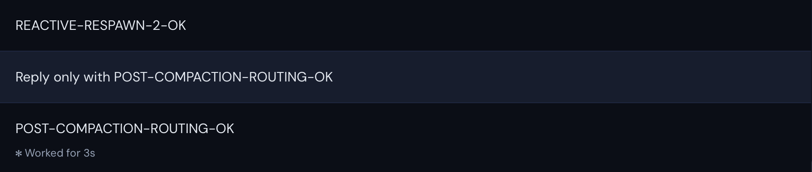
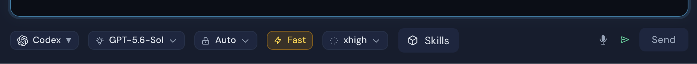

# Issue #3654 live walkthrough

## Original failure evidence

The supplied production log records this sequence:

1. Connected-account discovery repeatedly completed with seven providers.
2. Tail relief detected an over-budget preserved tail and pruned its accounted
   tokens from 144,417 to 15,415.
3. The replacement reported ready, then OAuth routing immediately failed with
   `OAuth routing session not found` for that same stable session ID.
4. Restoring the model failed with `Session not found`, and the tail-relief
   respawn timed out after 30 seconds.

The log is interleaved with a separate Claude/Fable session. The direct-session
dispatcher explains the misleading provider name: after a Codex replacement is
deleted, routing falls through to the Claude runtime, which supplies the
missing-session error text.

The referenced local `dead.png` no longer contains the reported Codex screen,
so it is intentionally not included in this public evidence packet. No private
log content, account identifiers, local paths, or sidebar history is included.

## Fixed build walkthrough

The walkthrough used the real macOS Tauri validation bundle, a real signed-in
Seren account, the installed Codex CLI, and the live provider runtime. No mocks,
stubs, simulated routing state, or copied production credentials were used.

1. Opened the affected persisted Codex thread in the native app.
2. Confirmed the runtime-selected provider and model were Codex and
   GPT-5.6-Sol. The live Codex catalog reported a 258,400-token context window.
3. Disabled the user-facing auto-compact switch and relaunched the validation
   app so no successful turn could pre-warm a predictive standby.
4. Submitted a repository-backed prompt below the model's single-prompt limit
   into the already-full conversation.
5. Observed the serving Codex child exit, a brief zero-child interval, and a new
   Codex child start under the same persisted thread while the prompt stayed in
   the real UI.
6. Confirmed the compacted retry completed as `REACTIVE-RESPAWN-2-OK` without
   the connected-account routing banner.
7. Submitted a normal follow-up on the replacement. It completed as
   `POST-COMPACTION-ROUTING-OK`, proving the replacement remained registered
   and routable after the old process's terminal event.

## Live completeness checks

- The runtime's live agent source of truth reported six available coding
  agents: Claude Code, Codex, Claude + Codex, Antigravity, Grok, and LM Studio.
  The New menu exposed all six.
- The installed Codex runtime reported seven models: GPT-5.6-Sol,
  GPT-5.6-Terra, GPT-5.6-Luna, GPT-5.5, GPT-5.4, GPT-5.4-Mini, and
  GPT-5.3-Codex-Spark. The agent model picker exposed all seven.
- The submit path refreshes the first-party OAuth connections, OAuth providers,
  and publisher inventory endpoints before applying routing through the local
  `provider_set_oauth_routing` RPC. The failure path invokes no outbound
  publisher tool slug.

## Validation

- Focused Codex lifecycle checks: 3 files, 6 tests passed.
- Full unit suite: 432 files, 2,993 tests passed.
- Provider runtime build and smoke test passed.
- Frontend production build and build-manifest verification passed.
- Native validation app and macOS debug bundle builds passed.
