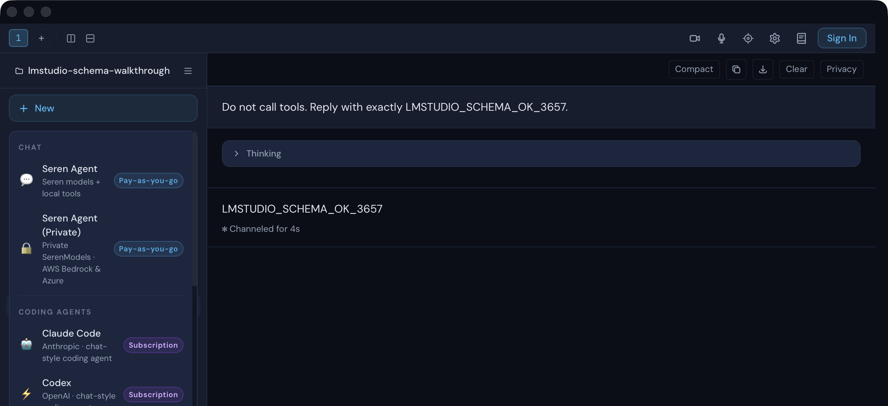
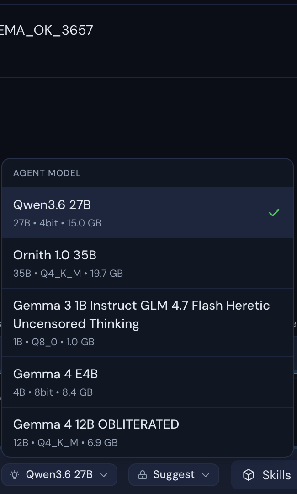
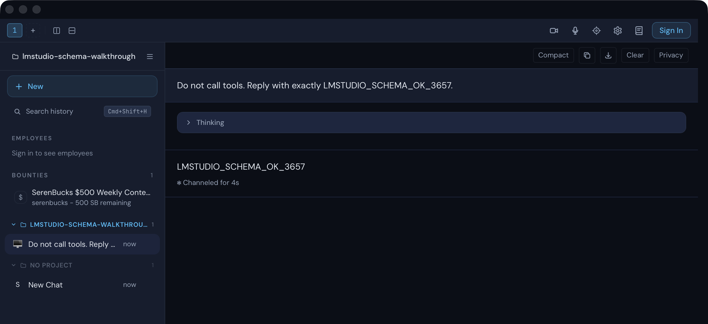
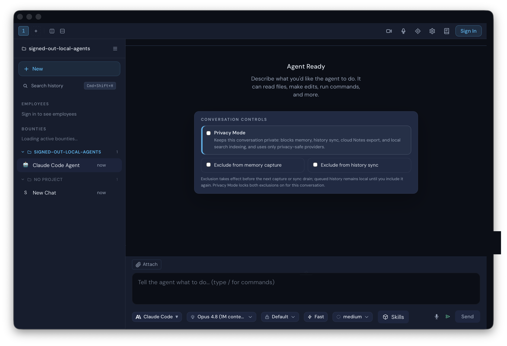
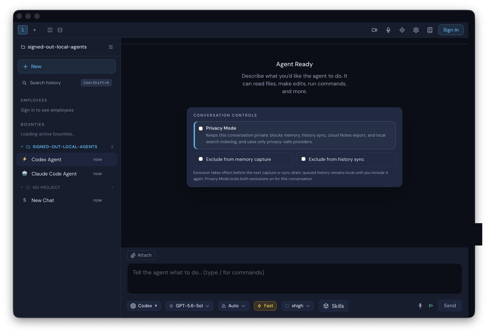
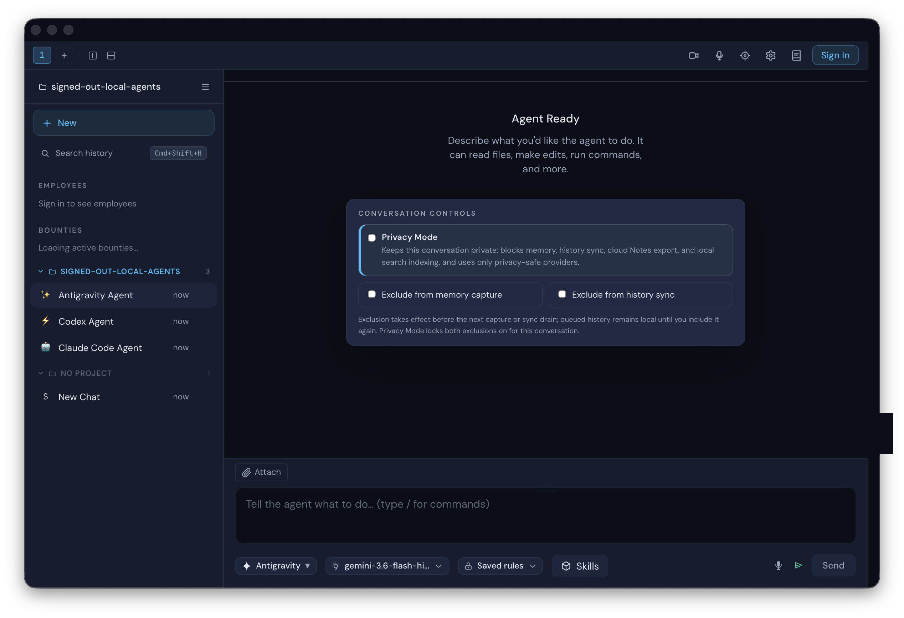
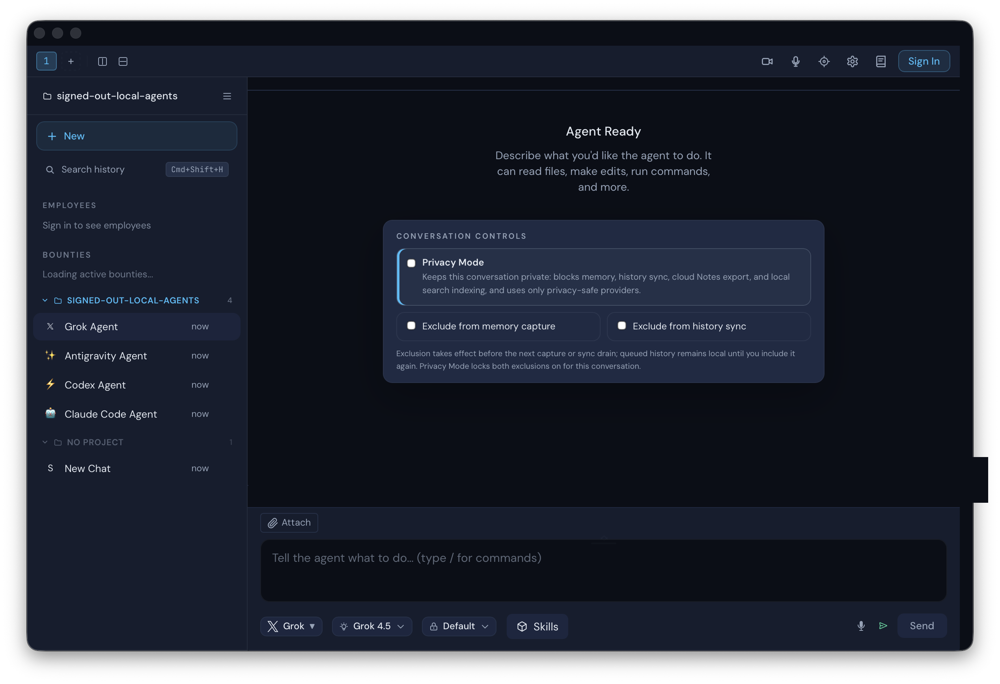
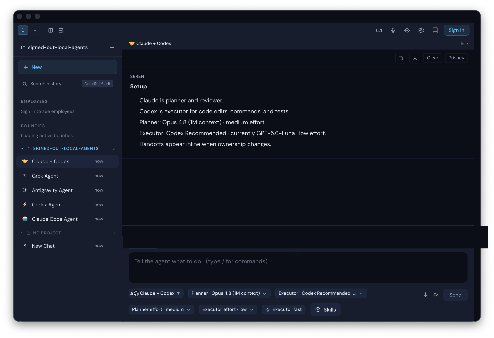
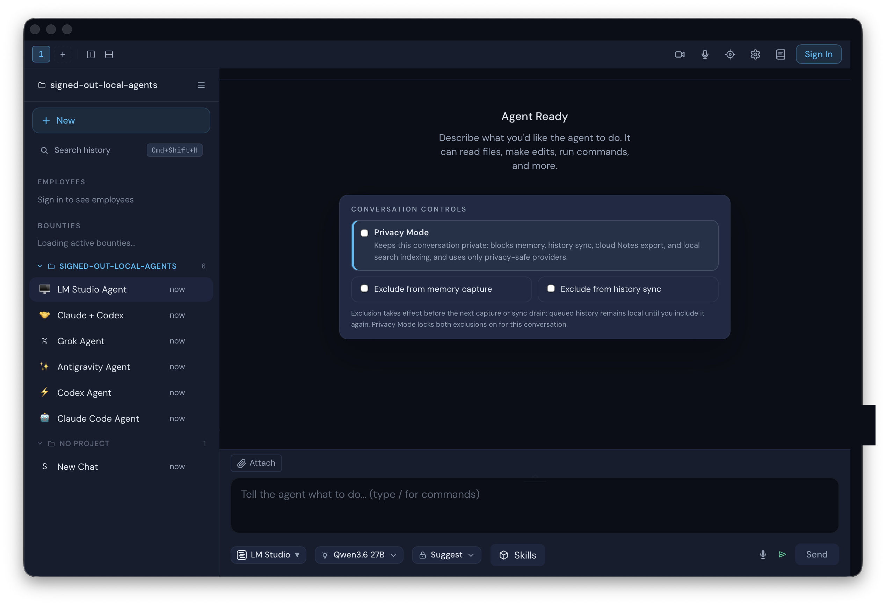

# Issue 3657 live walkthrough

Date: 2026-08-03

Platform: macOS native Tauri validation app

State: isolated local project, signed out. Seren authentication is not required for local agents.

## Failure audit

The private support log recorded an LM Studio HTTP 400 while converting MCP tool schemas with local JSON Schema references. The pre-fix adapter copied `properties`, `required`, and `additionalProperties`, but discarded the matching `$defs`, leaving those references unresolved.

The original server response could not be replayed against the currently installed LM Studio build: its present converter accepted both the old reduced schema and the corrected schema in a direct probe. The broken code path and request shape were therefore protected with a focused request-builder regression test rather than presenting a simulated “before” walkthrough.

The audit also found that starting a local agent while signed out opened Seren's sign-in flow. The first repair exempted only LM Studio; review then identified the same defect for Claude, Codex, Gemini/Antigravity, and Grok. The launch gate is now removed for every agent type advertised by the live local provider runtime, including Claude + Codex.

## Fixed walkthrough

1. Launch the native validation app with isolated app data and no Seren session.
2. Read the complete agent list from the live local provider runtime.
3. Open **+ New** and launch Claude, Codex, Gemini/Antigravity, Grok, Claude + Codex, and LM Studio through the real UI.
4. After every launch, confirm the selected provider is visible while the title bar still shows **Sign In** and no Seren sign-in dialog appears.
5. For LM Studio, open the model picker and compare every rendered option with `lms ls --llm --json` from the installed CLI.
6. Send a real local chat prompt through LM Studio's OpenAI-compatible endpoint and confirm the requested marker completes without a schema-conversion error.

## Scrubbed native evidence

The captures retain only the app state needed for review. Private paths, account data, tokens, control metadata, and screenshot metadata are excluded.

The provider launcher is open while the title bar still shows **Sign In**:

All five installed chat models appear in the same order as the live LM Studio CLI inventory:

The real local assistant response completes while the app remains signed out:

Every agent advertised by the live local runtime launches while the title bar remains signed out:

## Completeness result

- Five of five downloaded chat models were rendered in exact CLI order.
- No extra model option was rendered.
- The installed embedding model was excluded from this chat-model picker.
- The first live chat model remained selected for the walkthrough request.
- The assistant returned `LMSTUDIO_SCHEMA_OK_3657` without showing the prior schema-conversion error.
- Six of six live runtime agent types were launched: Claude, Codex, Gemini/Antigravity, Grok, Claude + Codex, and LM Studio.
- The walkthrough compares its launcher coverage with `provider_get_available_agents`; a partial or stale list fails validation.
- Seren sign-in was never requested during any local launch.
- Provider-owned CLI authentication remains unchanged and is not treated as Seren authentication.

Machine-readable results are recorded in [verification.json](./verification.json).

## Network path

The changed launch path has no Seren publisher slug or Seren API request. A launcher click calls `spawnSession`, which omits the credential lease and publisher tools when signed out, then sends the selected agent type to the local provider runtime. Claude, Codex, Gemini/Antigravity, and Grok retain their provider-owned CLI/SDK authentication and networking; Claude + Codex composes the Claude and Codex local runtimes. LM Studio model discovery invokes the installed `lms` CLI, and inference goes to its local OpenAI-compatible `POST /v1/chat/completions` endpoint on loopback. Optional signed-in MCP tools remain dynamically discovered; no publisher, permission, tool, or model inventory is hardcoded by this change.
