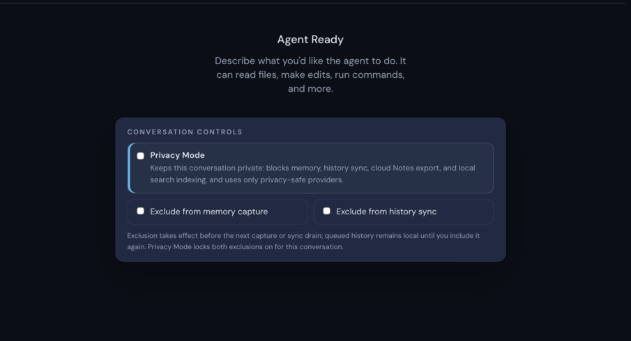
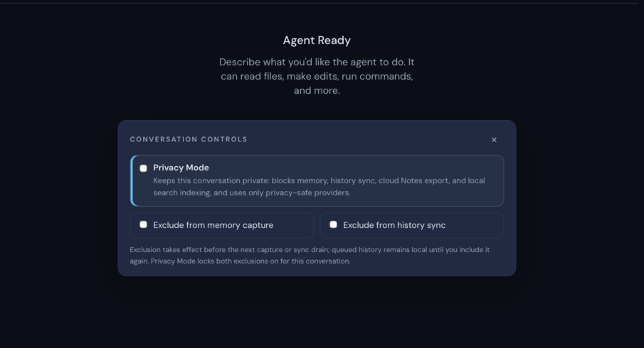
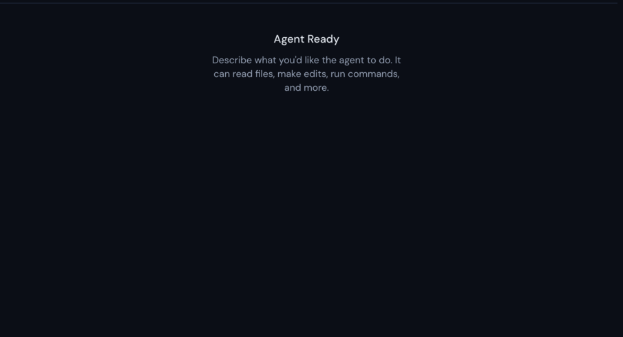
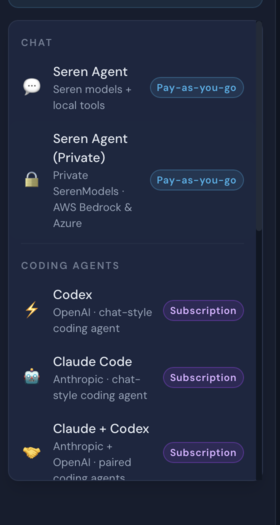

# Issue #3682 live walkthrough

Date: 2026-08-04

Platform: macOS native Tauri validation app

State: isolated local project, signed out. Seren authentication is not required
to start the local Codex agent used for this UI behavior.

## Baseline reproduction

1. Launched the untouched `main` app at commit `a4af87f8`.
2. Opened **New** and started the real local Codex agent.
3. Confirmed the **Conversation controls** panel appeared.
4. Queried the live DOM and confirmed no dismiss action existed.

## Fixed walkthrough

1. Launched the native validation build from the issue branch.
2. Read the complete agent catalog from the running provider runtime with
   `provider_get_available_agents`.
3. Opened **New** and compared every coding-agent launcher with that live
   catalog. The six runtime types and six mounted launchers matched exactly.
4. Started the real local Codex agent and confirmed the banner now had a
   labelled dismiss control.
5. Clicked the dismiss control and confirmed the banner left the layout while
   the conversation remained ready for input.
6. Opened **New**, started a second real Codex agent, and confirmed its own
   controls banner appeared.

Step 6 (a second agent receives its own banner) was performed live and its
assertion passed in `verification.json`, but the packet originally presented a
byte-identical copy of the step-4 capture as its screenshot. The duplicate has
been removed (#3705); the step's visual capture is pending the next live
walkthrough of this flow. The behavior itself is code-verified: dismissal is
keyed per conversation id, and each pane mounts its own panel instance.

The live launcher used in the walkthrough:

## Completeness result

- Live runtime: Claude Code, Codex, Claude + Codex, Antigravity, Grok, and LM
  Studio.
- Mounted New menu: the same six agent types; no missing or extra entry.
- The walkthrough fails if the live runtime adds an unmapped type or the menu
  omits a live type.
- The compact banner dismisses only its presentation. Privacy Mode and both
  exclusion settings are unchanged.
- The full Privacy settings panel remains non-dismissible and unchanged.

Machine-readable results are recorded in [verification.json](./verification.json).

## Evidence privacy

The images are deterministic crops from native window captures. The crops
remove account data, local paths, unrelated thread history, and screenshot
metadata. No mock, stub, or simulated app state was used.

## Validation

- Focused Biome check: passed.
- Production frontend build: passed.
- Full frontend suite: 437 files and 3,007 tests passed.
- Pre-fix native baseline walkthrough on macOS: passed.
- Fixed native walkthrough on macOS: passed three times, including the final
  privacy-safe evidence run.
- `git diff --check`: passed.
- Repository-wide `tsc --noEmit` remains red on unrelated pre-existing
  declarations and tests; the product build passed.

## Network path

The changed dismiss action is conversation-scoped frontend state. It has no
outbound publisher or third-party API slug, method, or path. Completeness
validation reads the local Tauri command `provider_get_available_agents` and
its loopback provider runtime.
