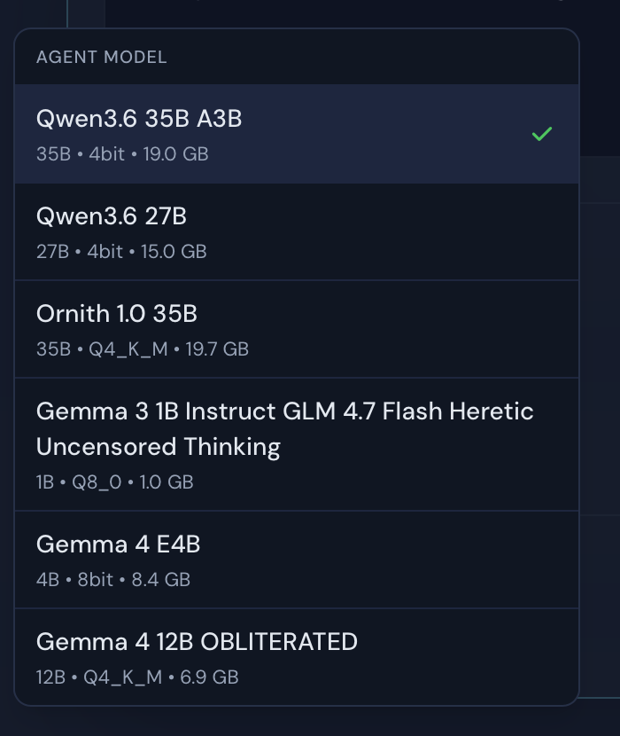
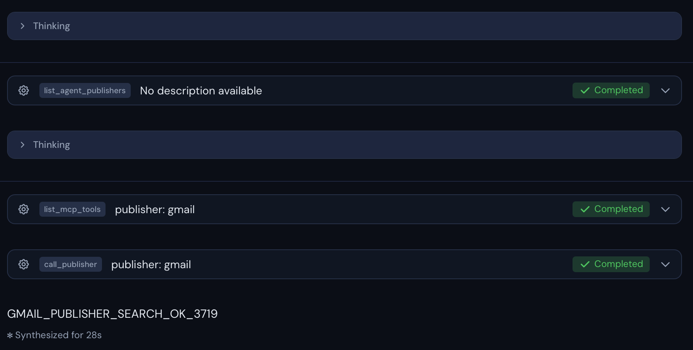
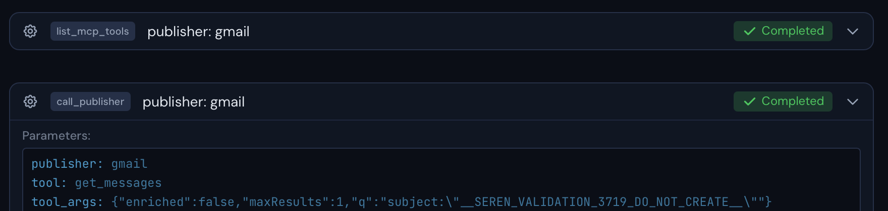

# Issue #3719 live walkthrough

Date: 2026-08-05

Platform: macOS native Tauri validation app

State: dedicated non-production Seren validation identity with one valid Google
connection. The current Seren Desktop app and the production Seren account were
not used, signed in, or signed out during this walkthrough.

## Original failure evidence

The supplied LM Studio log records the local model trying to use Gmail through
the Seren gateway, then failing with `not in the configured endpoint allowlist`.
The affected 8,192-token session could receive a large live tool catalog and
large discovery results without retaining the small routing-tool schemas needed
for the next round. The model then guessed an endpoint instead of completing the
gateway's discovery and generated-tool route.

The source log is private and is intentionally excluded from this public
packet. No account identifiers, connection selectors, mailbox data, local
paths, or unrelated conversation history are included here.

## Fixed build walkthrough

The walkthrough used the issue branch's real native validation bundle, a live
signed-in validation account, the locally installed LM Studio server, and the
live Seren gateway. No mocks, stubs, copied production session, or simulated
publisher state were used.

1. Loaded a tool-trained local model with the reproduced 8,192-token context.
2. Opened a new LM Studio agent and compared its complete model picker with
   `lms ls --llm --json`. All six live models appeared once and in source order.
3. Submitted a read-only prompt requiring this exact order:
   `list_agent_publishers` with no arguments, `list_mcp_tools` for `gmail`, then
   `call_publisher` for `gmail/get_messages` with a sentinel query that should
   not match real mail.
4. Approved each tool in the native UI. The model completed live publisher
   discovery, live Gmail tool enumeration, and the generated read tool.
5. Confirmed the final marker appeared only after `get_messages` completed.
   No message body, account address, or mailbox result was displayed.

## Completeness result

- The native provider source reported six available agent types. All six had a
  mounted New-menu launcher; the walkthrough fails if a live type has no UI
  mapping.
- The live LM Studio source reported six downloaded LLMs. The picker matched
  their exact count and order; an extra or missing option fails the walkthrough.
- A tool-trained model was loaded at exactly 8,192 tokens before submission.
- The signed-in validation identity had exactly one valid Google connection.
- The live publisher list contained `gmail`, its live tool enumeration exposed
  `get_messages`, and that generated tool completed successfully.
- The original endpoint-allowlist failure did not appear.

Machine-readable results are recorded in
[verification.json](./verification.json).

## Network path

The UI sends the local model's approved calls through Seren's HTTP MCP client:

1. MCP tool `list_agent_publishers`, arguments `{}`.
2. MCP tool `list_mcp_tools`, arguments `{ "publisher": "gmail" }`.
3. MCP tool `call_publisher`, arguments containing publisher slug `gmail`, tool
   slug `get_messages`, and the read-only sentinel query.

Each is an MCP `tools/call` request over HTTPS POST to the configured Seren MCP
endpoint at `/mcp`. The `gmail` publisher and `get_messages` tool slugs were
verified against the live gateway before execution. The changed feature has no
direct Gmail REST path; Seren's gateway owns the downstream provider request.

## Evidence privacy and safety

- The images are deterministic crops from native validation-window captures.
- Crops remove identity controls, account data, balances, local paths, sidebar
  history, recording controls, and unrelated app content.
- The query is a synthetic sentinel and the tool used `maxResults: 1` with
  enrichment disabled.
- No send, draft, modify, trash, delete, or account-identity tool ran.
- No mailbox content was included in the validation output or evidence.

## Validation

- Focused regression suite: 3 files, 39 tests passed.
- Biome check: passed with 48 pre-existing warnings and one schema-version
  information notice.
- Changed-file TypeScript audit: no errors. Repository-wide `tsc --noEmit`
  remains red on unrelated pre-existing declarations and tests.
- Provider runtime syntax check: passed.
- Provider runtime build and smoke test: passed.
- `git diff --check`: passed.
