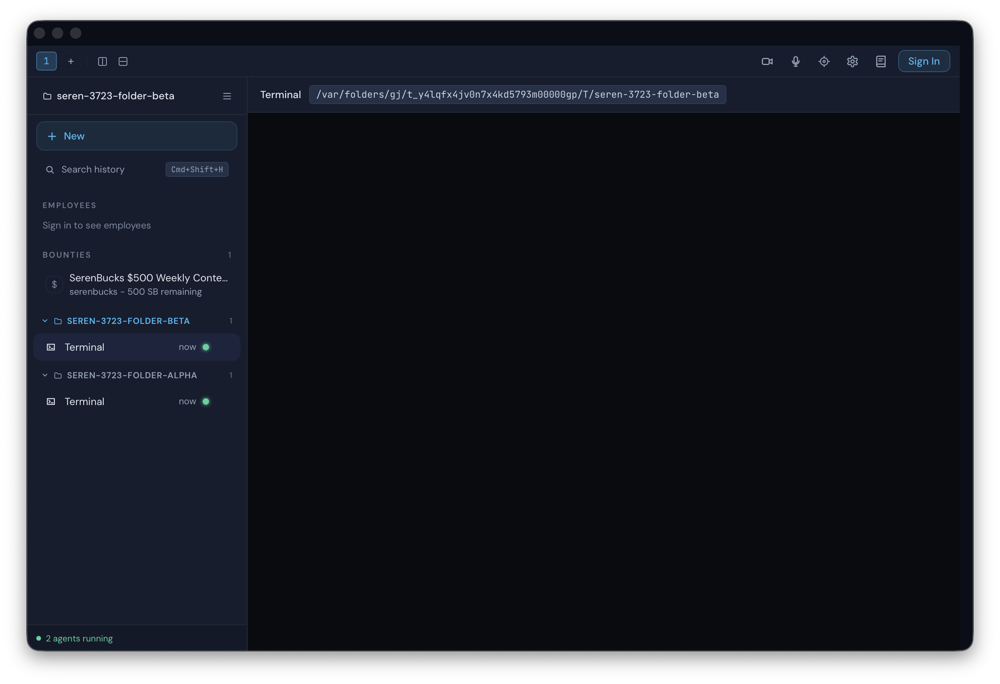

# Issue #3723 — Folder header green "active" dot vs total count

Live validation walkthrough for removing the green `bg-green-500` "active" dot
from thread-sidebar folder group headers, where it sat next to the folder's
**total** thread count and conflated "active" with "total".

## Scenario

`tests/validation/scenarios/folder-header-active-dot.ts`, run through
`pnpm validate:walkthrough folder-header-active-dot` against the real
validation-isolated Tauri app on macOS (arm64), signed out.

Steps (identical before and after):

1. Wait for `[data-testid='thread-sidebar']`.
2. Create two project folders anchored by a **running** terminal thread each
   (`seren-3723-folder-alpha`, `seren-3723-folder-beta`). A fresh terminal
   buffer reports `status: "running"` until its shell exits, so each folder is
   genuinely "active" — the exact state the green dot keyed off.
3. Capture the sidebar (native window capture + DOM raster + text dump).
4. Probe for `[data-testid='thread-sidebar'] .bg-green-500` (the folder dot was
   the only `bg-green-500` element inside the sidebar; per-row and footer
   running indicators use `bg-status-running`).

No PII: signed-out isolated instance, temp-dir folder names only.

## Before (on `main`)

`before-verification.json` → `runningDotPresentInSidebar: true`. The scenario's
regression assertion fails on `main`, proving the dot renders while folders have
running threads.

Each folder header (`SEREN-3723-FOLDER-ALPHA`, `SEREN-3723-FOLDER-BETA`) shows a
green dot immediately next to the total count `1`, while the footer separately
reads "2 agents running".

## After (on the fix branch)

`after-verification.json` → `runningDotPresentInSidebar: false`. The scenario
passes: the folder headers still show their total count, with no green dot, even
though both folders have a running terminal.

## What is preserved

- Per-thread-row running dot (`bg-status-running`) on each active thread row.
- Footer "N agents running" count (`threadStore.runningCount`) — the
  authoritative active indicator.
- Running-folders-first group sort (`folderRunning()` in `thread.store.ts`),
  which is independent of the removed dot.
